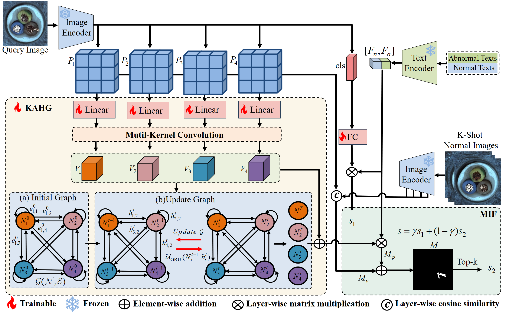

# Kernel-Aware Graph Prompt Learning for Few-Shot Anomaly Detection [AAAI 2025]
Fenfang Tao, Guo-Sen Xie1, Fang Zhao, Xiangbo Shu.
## Overview of KAG-prompt

## How to Run
### Environment installation
Install the required packages:
```bash
pip install -r requirements.txt
```
### Prepare your dataset
You can download MVTec-AD dataset from [[this link]](https://www.mvtec.com/company/research/datasets/mvtec-ad/downloads) and VisA from [[this link]](https://github.com/amazon-science/spot-diff). After downloading, please modify the corresponding data loading path.

### Prepare checkpoint
You can download the pre-trained ImageBind model using [[this link]](https://drive.google.com/file/d/1jLpa_YCL_bOHtSZ1FpZygfQFHJOrWe71/view?usp=drive_link). After downloading, put the downloaded file (imagebind_huge.pth) in [[./pretrained_ckpt/imagebind_ckpt/]](./pretrained_ckpt/imagebind_ckpt/) directory. 

You can download the the pre-trained weights using [[this link]](https://drive.google.com/file/d/1WVPpRKhO-1KBgbo_2JYH67F5fglKxU-I/view?usp=sharing) and [[this link]](https://drive.google.com/file/d/1Reig-0RUnF1yyD7wYRoioJJ04kfRndgw/view?usp=drive_link). After downloading, place them into [[./code/ckpt/train_mvtec]](./code/ckpt/train_mvtec/) and [[./data//ckpt/train_visa]](./data//ckpt/train_visa/) directory respectively.

### Test
*Quick start (use the pre-trained weights)
```bash
cd /KAG-prompt/code
python test_visa.py
pyhton test_mvtec.py
```

# Train your KAG-prompt
```bash
bash ./scripts/train_mvtec.sh
bash ./scripts/train_visa.sh
```
